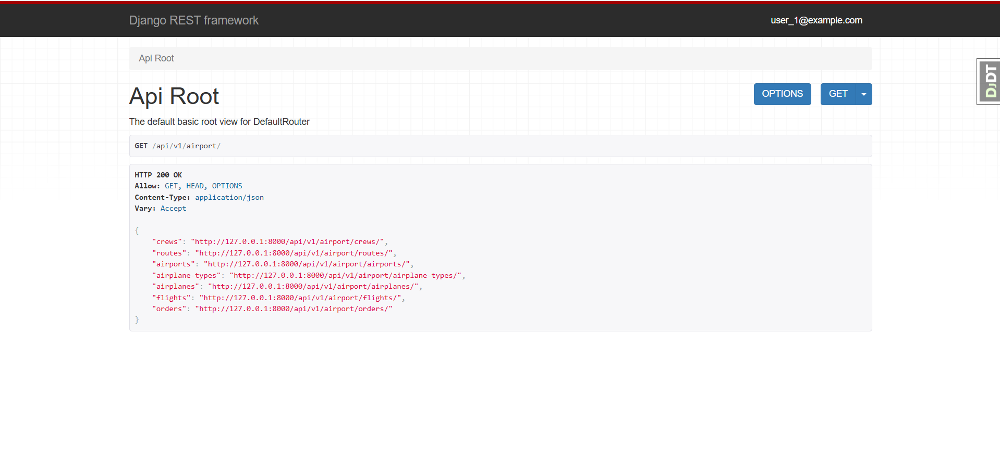
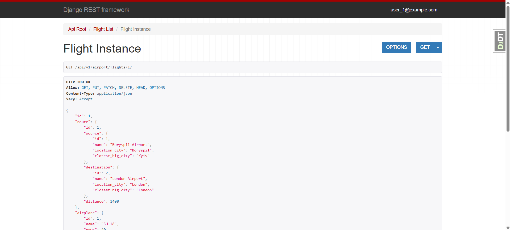

# ✈️ Airport API

[](https://github.com/apmaz/airport-api)
[](https://www.python.org/)
[](https://www.djangoproject.com/)
[](https://www.postgresql.org/)
[](https://www.docker.com/)

## 📋 Contents

- [🔧 Features](#-features)
- [🛠 Technologies](#-technologies)
- [📦 Installation (GitHub → Docker)](#-installation-github--docker)
  - [🐙 Installation using GitHub](#-installation-using-github)
  - [🐳 Installation using Docker](#-installation-using-docker)
- [👤 Users and Authentication](#-users-and-authentication)
  - [Using JWT token](#using-jwt-token)
- [📚 Documentation](#-documentation)
- [🧪 Test Data](#-test-data)
- [🧪 Testing](#-testing)
- [📦 Core Models](#-core-models)
- [📌 Examples of Use](#-examples-of-use)

---

## 🔧 Features

- ✈️ Management of flights, routes, and crew
- 🎟 Ticket ordering and booking  
- 🔍 Flight filtering by date and destinations  
- 🔐 JWT authentication  
- 🧑‍💻 Admin panel: [`/admin/`](http://localhost:8000/admin/) 
- 📄 Swagger and Redoc documentation  
- 🔁 Pagination, rate limiting  
- ✅ Tests and code style checks (flake8)

## 🛠 Technologies

- Python 
- Django, Django REST Framework  
- PostgreSQL  
- Docker, Docker Compose

## ⚙️ Installation (GitHub → Docker)

###  🐙 Installation using GitHub

#### 1. Install PostgreSQL and create a database

#### 2. Clone the project

```bash

git clone https://github.com/apmaz/airport-api.git
cd airport-api
```

#### 3. Create a virtual environment and install dependencies. If you are using PyCharm, it might suggest automatically creating a venv and installing requirements, but if not:

```bash

python -m venv venv
venv\Scripts\activate (on Windows)
source venv/bin/activate (on macOS)
pip install -r requirements.txt
```

#### 4. Set environment variables

👉 Windows:

```bash

set DB_USER=your_user_name
set DB_NAME=db_name
set DB_HOST=db_host
set DB_PASSWORD=your_password
set SECRET_KEY=your_secret_key
```

👉 Linux/macOS:

```bash

export DB_USER=your_user_name
export DB_NAME=db_name
export DB_HOST=db_host
export DB_PASSWORD=your_password
export SECRET_KEY=your_secret_key
```

#### 5. Run migrations and start the server

```bash

python manage.py migrate
python manage.py runserver
```

### 🐳 Installation with Docker

#### 1. Clone the project

```bash

git clone https://github.com/apmaz/airport-api.git
cd airport-api
```

#### 2. Rename `.env.sample` to `.env` and fill in the values:

```bash

mv .env.sample .env

DB_USER=your_user_name
DB_NAME=db_name
DB_HOST=airport_api_db
DB_PASSWORD=your_password

PGDATA=/var/lib/postgresql/data/

SECRET_KEY=your_secret_key
```

#### 3. Build and run the project

```bash

docker-compose up --build
```

The service will be available at: [http://localhost:8000/api/v1/airport/](http://localhost:8000/api/v1/airport/)

## 👤 Users and Authentication
This section describes the main API endpoints for working with users: registration, obtaining and refreshing JWT tokens, token validation, and accessing the authenticated user’s profile information.

- Registration: [`/api/v1/user/register/`](http://localhost:8000/api/v1/user/register/)
- Token obtain: [`/api/v1/user/token/`](http://localhost:8000/api/v1/user/token/)
- Token refresh: [`/api/v1/user/token/refresh/`](http://localhost:8000/api/v1/user/token/refresh/)
- Token verify: [`/api/v1/user/token/verify/`](http://localhost:8000/api/v1/user/token/verify/)
- User profile: [`/api/v1/user/me/`](http://localhost:8000/api/v1/user/me/)

### Using JWT token
This project uses [JWT (JSON Web Token)](https://www.django-rest-framework.org/api-guide/authentication/#json-web-token-authentication) authentication. After successful login, you receive an access token, which should be included in every request to protected resources.

To access such endpoints, include the access token in the HTTP request header as follows:

- Authorization: Bearer <access_token>

⚠️ In Swagger, enter only the token itself (without "Bearer"), otherwise authorization will fail ⚠️  

If the token is missing or invalid, the server will return an authorization error (e.g., 401 Unauthorized).

#### Using JWT token in Postman

👉 Automatic token insertion

1. Open any request to a protected endpoint in Postman.
2. Go to the Authorization tab.
3. Select Bearer Token in the Type field.
4. Paste the access token into the Token field.
Postman will automatically add the Authorization: Bearer <token> header to your requests.


👉 Manual Authorization header setup
1. Go to the Headers tab.
2. Add a new header with the name Authorization.
3. In the value field, enter: Bearer <your_access_token>
Send the request.


## 📚 Documentation
Here are links to the automatically generated API documentation using Swagger and Redoc. You can explore available endpoints, their parameters, and example requests and responses:

- Swagger: [http://localhost:8000/api/v1/doc/swagger/](http://localhost:8000/api/v1/doc/swagger/)  
- Redoc: [http://localhost:8000/api/v1/doc/redoc/](http://localhost:8000/api/v1/doc/redoc/)

## 🧪 Test Data
Use the following command to load prepared fixture data for exploring Airport API features in more detail:

```bash

python manage.py loaddata airport_api_db_data.json
```

For convenience, you can log in with the following test accounts:

| Email                | Password |
|----------------------|----------|
| admin@example.com    | password |
| user_1@example.com   | password |
| user_2@example.com   | password |
| user_3@example.com   | password |

## 🧪 Testing

```bash

python manage.py test flight.tests

python manage.py test user.tests

flake8
```

## 🧩 Main Models

---

### Flight
- **route** – route (Route)  
- **airplane** – airplane (Airplane)  
- **crew** – crew (Crew)  
- **departure_time** – departure time  
- **arrival_time** – arrival time  

---

### Route
- **source** – departure airport (Airport)  
- **destination** – arrival airport (Airport)  
- **distance** – distance  

---

### Airplane
- **name** – airplane name  
- **rows** – number of rows  
- **seats_in_row** – seats per row  
- **airplane_type** – airplane type (AirplaneType)  

---

### AirplaneType
- **name** – airplane type name  

---

### Crew
- **first_name** – first name  
- **last_name** – last name  
- **crew_photo** – crew member photo  

---

### Airport
- **name** – airport name  
- **location_city** – city where the airport is located  
- **closest_big_city** – nearest big city  

---

### Ticket
- **row** – row  
- **seat** – seat  
- **flight** – flight (Flight)  
- **order** – order (Order)  

---

### Order
- **created_at** – order creation date  
- **user** – user who placed the order (User)  

---


---

## 📌 Examples of Use






---